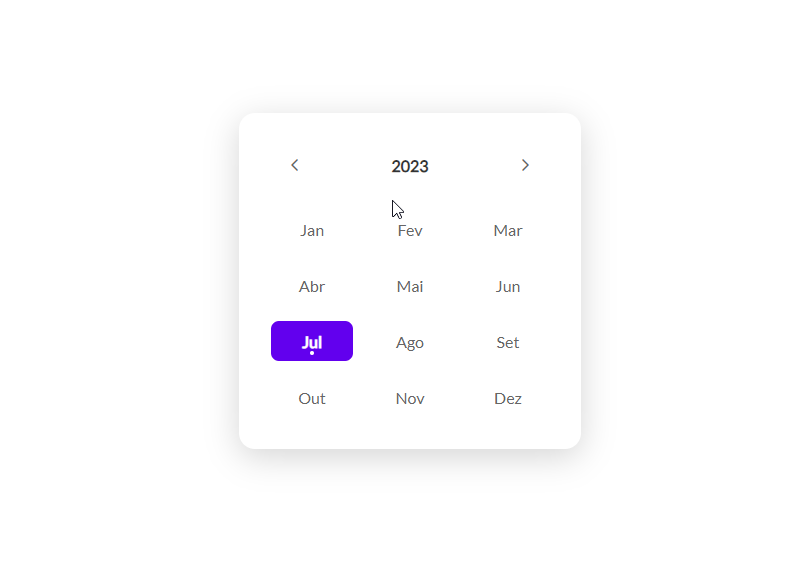

# Bora Codar 17 - Date Picker 

  

 

  📝Desafio Date Picker da semana 17 do #boraCodar da Rocketseat
  - Revisei e aprendi mais sobre o display grid no css
  - Aprendi alguns conceitos novos de JavaScript, como o `new Date().getMonth()` e `new Date().getFullYear()`  

  🎨 <a href="https://www.figma.com/file/orq5pulFSnuNCpk2yf8ED9/%23boraCodar---Desafio-17-(Community)-(Copy)-(Copy)?type=design&node-id=1-173&mode=design&t=YeJYA4yUyVSubN8v-0">Figma do desafio </a>
  
  👾 <a href="https://samuelvitor1.github.io/Projetos-Desafios-LandingPages/Bora%20Codar/bora-codar17/index.html">Site</a>

  🖥️Tecnologias usadas:

   
 
    
    
  
